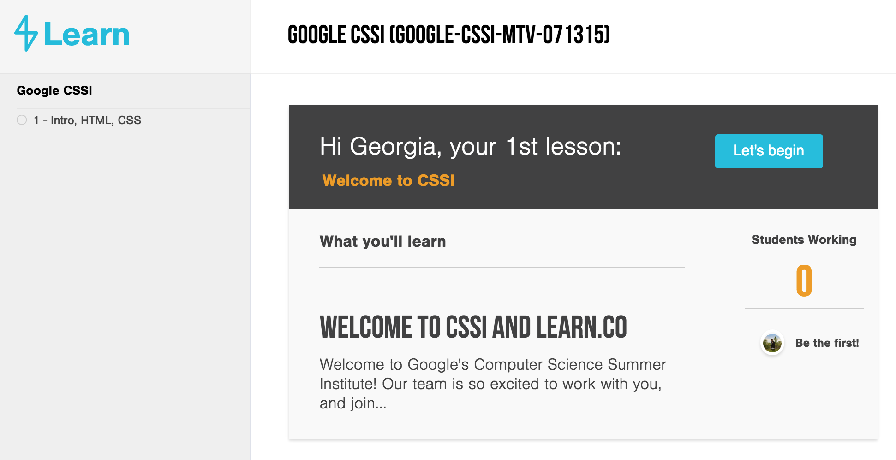

#Intro to the Web

#Objectives:
+	Explain how loading a web page in your browser works
+ Set up our learn.co and github accounts
+ Understand how to use learn.co for lesson notes and labs

#Why Should You Care?
How many times a day do you use the internet? How many times do you load a different web page? I bet you can't even begin to guess how many times in a year! In order to be a developer, and especially a web developer, it's incredibly important to understand how the web works.

#Intro to the Web
A web page is just a document with a bunch of code in it that your browser knows how to read an interpret.  Your browser is called the client, and the client is making a GET request (this request has both your computer IP address as the “from” and the web site’s IP address as the “to”. A GET request is a request to load information. We’re requested to get information for our browser. Once the server for YouTube receives our request, they send back a response, which includes all the code that makes up youtube.com

#Github Account
You should have received an email with instructions to setup a github account. If you haven’t done that already we will walk through it now.
Go to www.github.com and click the sign up button at the top right corner
You will be prompted to create a username, enter your address, and create a password.
The next page tells you to choose your plan and click the green “Finish sign up” button at the bottom
Finally on your dashboard click the “send verification email” button and go back to your email account to verify your email.

#Learn.co Account
Learn.co is our  learning management system which will hold all the student notes to each lesson. Each of you should have received an email that invited you to join learn.co

If you haven’t already click “Join Learn” to create an account which will bring you to a page to sign up. Use your github username and password to sign up for your learn.co account. The next page should prompt you to authorize learn.co to access your github account.
Once you are logged into learn.co you should see your dashboard. On the left is your menu panel which displays the lessons and labs for each module. The center column will display all of the notes content related to each module.

#Conclusion
Now that we know a little bit more about how the web works and we are setup with github and learn.co accounts lets jump into HTML!
